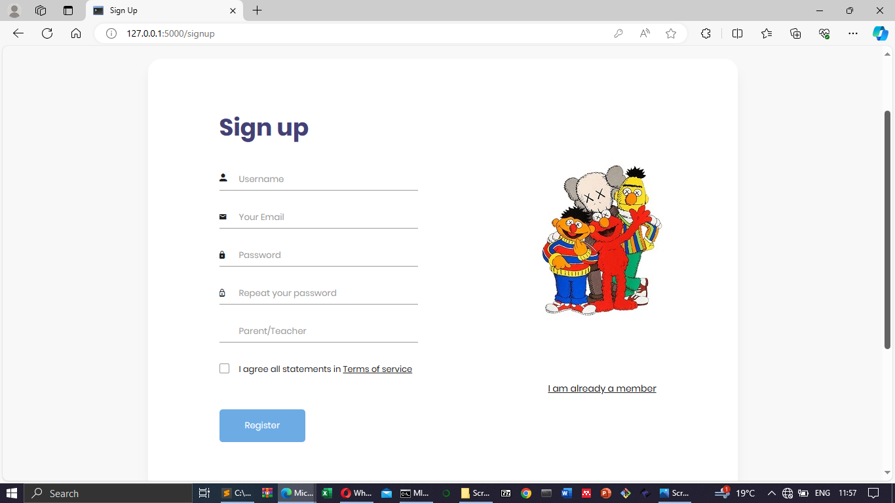
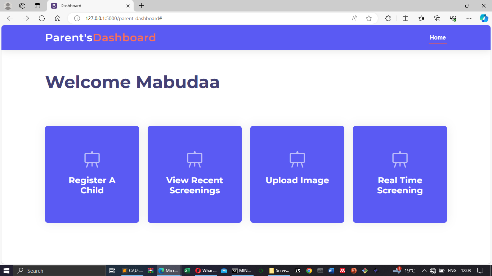
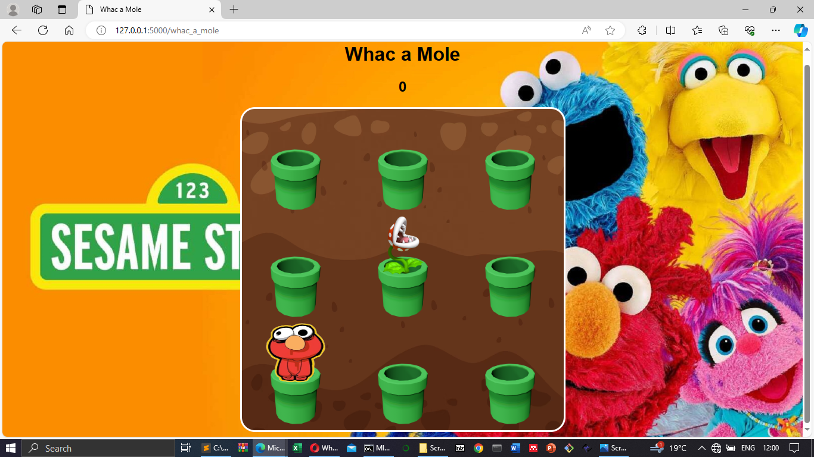
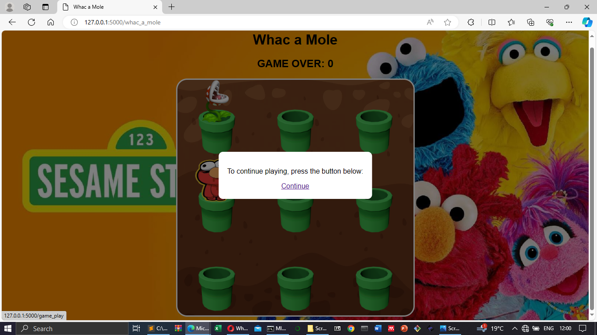
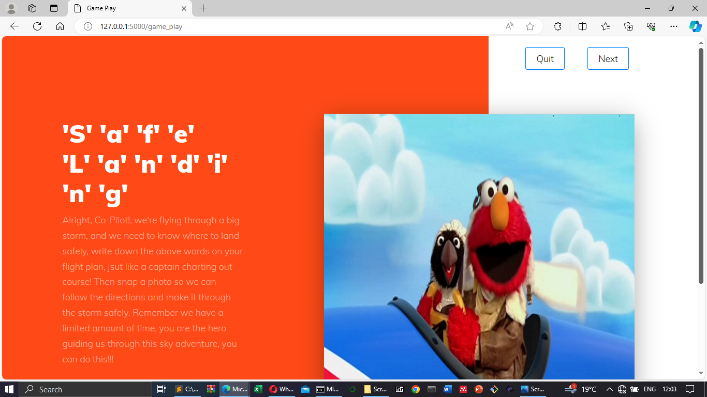
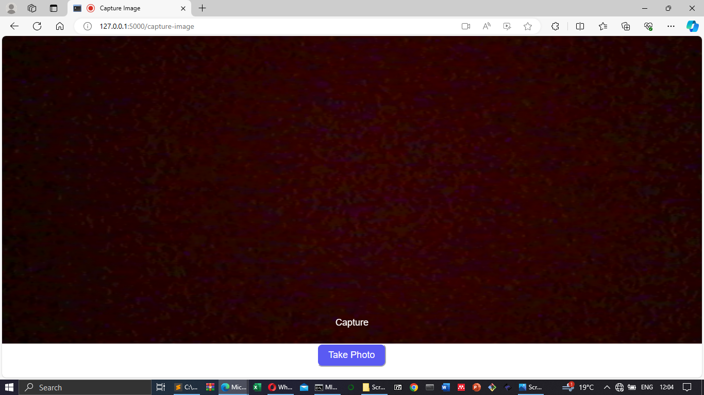

# Dyslexia Detection with Whac-A-Mole Game

## Overview
This project is an experimental web-based system for detecting dyslexia in children using handwriting analysis and gamification. The goal is to provide an engaging and interactive experience for early dyslexia screening through the use of handwriting image uploads and a game-like interface based on "Whac-A-Mole."

## How It Works
1. The child is prompted to upload an image of a handwritten script.
2. The system converts the image to grayscale using OpenCV (`cv2`).
3. Letter segmentation is performed, focusing primarily on the letter "m."
4. The segments are passed to a dyslexia prediction model.
5. Based on the predictions, the system bundles outputs and determines whether signs of dyslexia are present.

> Due to limited resources, the final dyslexia detection model could not be trained. The dataset intended for use is the "GAMBO" handwriting dataset available on Kaggle.

## Technologies Used
- Flask
- SQLAlchemy
- OpenCV (`cv2`)
- OS module (for file management)

## Dataset
- **Name**: Handwriting Dataset
- **Source**: [Kaggle - Dyslexia Handwriting Dataset](https://www.kaggle.com/datasets/drizasazanitaisa/dyslexia-handwriting-dataset)

## Flask API and Threading
The application backend is built with Flask. Both the dyslexia prediction logic and the API run in separate threads to maintain responsiveness and performance.

## Screenshots
### Land Page
)

###  Login
![Log In]

### Sign Up

### User Dashboard

### Child Registration

### Whac A Mole

### The Prompt

### Game Play

### Camera Capture

### Dignosis Results

> This is what the results page would look like after a successfull dignoise had the model been available.
---
## Disclaimer
This project is a prototype intended for research and educational purposes only. The dyslexia detection logic is not validated for clinical or diagnostic use.
