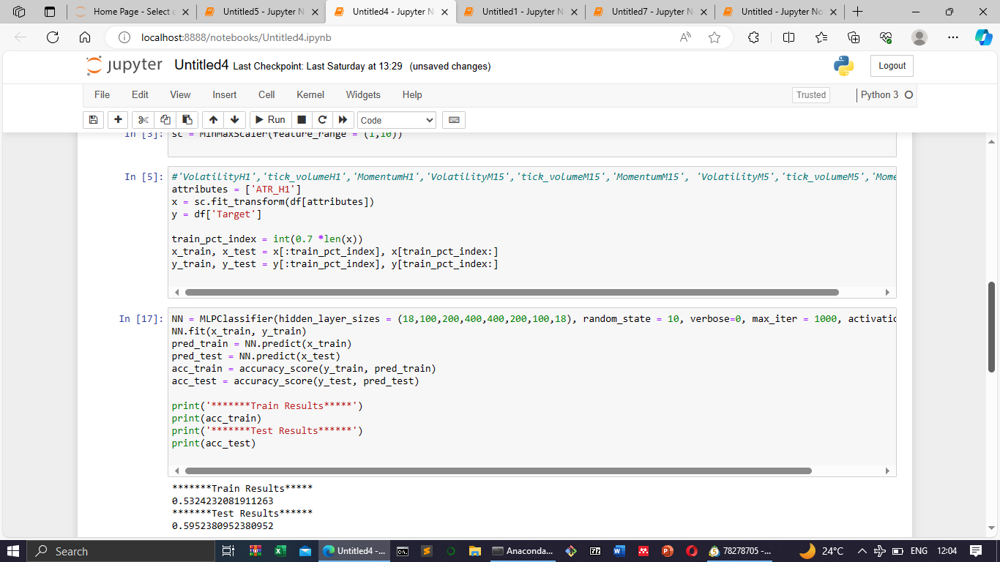

# Trading Bot

## Overview
This project is an automated trading loop built using Python. It analyzes trading opportunities and opens trades if all criteria are met. A custom-trained MQL classifier, developed in-house using past trade data, determines the risk for each opportunity. The goal of the system is to avoid missing opportunities, not to determine the perfect risk size. 

> The actual trading script uploaded here is **not** the one used in production, as the real one is profitable and proprietary.  
> The system currently runs only on **Windows machines**, due to the MetaTrader5 API only supporting Windows.

## How It Works
1. Every 5 minutes, the trading bot dynamically fetches tradable symbols using the Flask API.
2. It updates market data for each symbol.
3. For each symbol, it checks for scheduled news events. If any are found, it avoids trading near those times.
4. It analyzes the current trend and other market conditions to determine if a trading signal exists.
5. If a valid signal exists, a position is opened. Closing of trades is managed separately.

## Technologies Used
- Flask (runs the API and bot in separate threads)
- SQLAlchemy (for managing news and symbol data)
- MetaTrader5 (market data and order execution)
- Pandas and Pandas TA (technical analysis and data handling)

## Flask API and Threading
The Flask API and the trading bot both run in the same Python process using the `threading` module. This ensures the bot can operate continuously in the background while still accepting API requests for things like:
- Fetching and updating symbols
- Managing news events
- Monitoring trades

## Screenshots

### Positions Opened By Bot

### Simulation Equity Curve

### Model Training and Accuracy

## Disclaimer
This project is for **educational and experimental purposes only**. I am not a financial advisor and this is not financial advice.
  